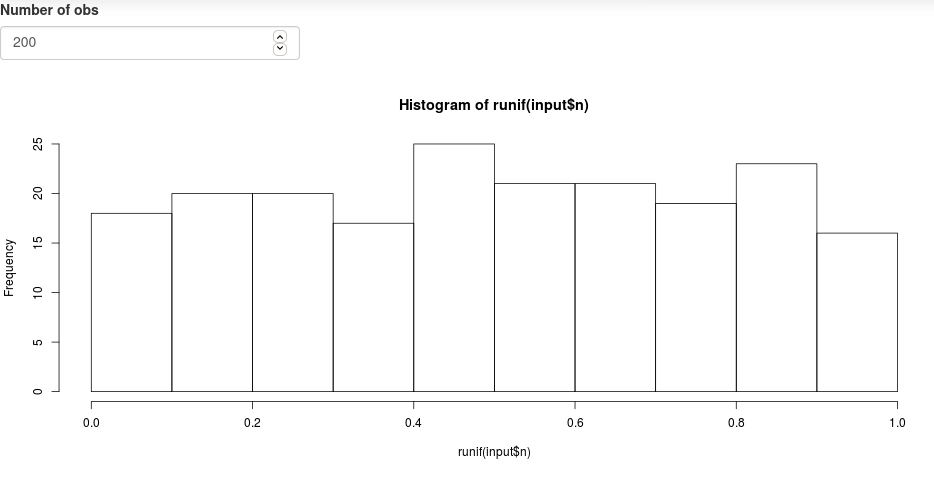

```{r include = FALSE}
source("_setup.R")
```

---
class: inverse, center, middle

# `r nf()` Minimal Shiny App


## `r ck()` ~20min


---
# Minimal Shiny App

`r lc()` [Simple shiny app](https://shiny.rstudio.com/gallery/single-file-shiny-app.html)

.pull-left[
```{r, eval = FALSE}
# Global variables can go here
n <- 200

# Define the UI
ui <- bootstrapPage(
  numericInput('n', 'Number of obs', n),
  plotOutput('plot')
)

# Define the server code
server <- function(input, output) {
  output$plot <- renderPlot({
    hist(runif(input$n))
  })
}

# Return a Shiny app object
shinyApp(ui = ui, server = server)

```
]

.pull-right[
  
  

]


---
# Minimal Shiny App

## Structure

- User interface object `ui`:

  - Controls layout and appearance of the app ( where to position the element to display)
  - Front end of the app
  - What the user sees and interacts with

--

- Server function `server`:

  - Instructions sent to the computer/server running R to build the app
  - Back end of the application

--

- A call to the shinyApp function `shinyApp(ui, server)`


---
# Minimal Shiny App: `ui` `r ey()`

```{r, eval = FALSE}
ui <- bootstrapPage(
  numericInput('n', 'Number of obs', n),
  plotOutput('plot')
)
```

--

1. `ui` is the output of a function that creates a Shiny UI page (HTML), which defines the layout and its content.

--

2. layout: `bootstrapPage()` (see [Application layout guide](https://shiny.rstudio.com/articles/layout-guide.html))

--

3. input: `numericInput()` (see [Control widget](https://shiny.rstudio.com/gallery/widget-gallery.html))

--

4. output: `plotOutput()` (see [Display reactive output](https://shiny.rstudio.com/tutorial/written-tutorial/lesson4/))

--

5. add HTML content with tags (see [Shiny HTML Tags Glossary](https://shiny.rstudio.com/articles/tag-glossary.html))


---
# Minimal Shiny App: `server` `r cg()`

```{r, eval = FALSE}
server <- function(input, output) {
  output$plot <- renderPlot({
    hist(runif(input$n))
  })
}
```

--

1. server is a function of `input` and `output` and optionally `session` (used latter, but not covered, see [Session object](https://shiny.rstudio.com/reference/shiny/1.6.0/session.html))

2. process output: `renderPlot()` (see [Display reactive output](https://shiny.rstudio.com/tutorial/written-tutorial/lesson4/))

`r tr()` all `render*()` functions render reactive **output**, they 
capture R expressions and perform some light pre-processing to make the object suitable for the corresponding `*Output()` function in `ui`.


---
# Minimal Shiny App: `server` `r cg()`

## [Reactive output](https://shiny.rstudio.com/tutorial/written-tutorial/lesson4/)

.font90[
| Output function (`ui`) | Render function (`server`) | Creates     |
| :--------------------- | :------------------------- | :-----------|
| `dataTableOutput`      | `renderDataTable()`        | DataTable   |
| `htmlOutput`           | `renderImage()`            | raw HTML    |
| `imageOutput`          | `renderImage()`            | image       |
| `plotOutput`           | `renderPlot()`             | plot        |
| `tableOutput`          | `renderTable()`            | table       |
| `textOutput`           | `renderText()`             | text        |
| `uiOutput`             | `renderUI()`               | raw HTML    |
| `verbatimTextOutput`   | `renderVerbatimText()`     | text        |
]


---
# Minimal Shiny App: run the app

```{r, eval = FALSE}
shinyApp(ui = ui, server = server)
```

`r lc()` Trigger the application. 

--

There are several ways to do so, see [App formats and launching apps](https://shiny.rstudio.com/articles/app-formats.html).


---
# Minimal Shiny App: try it out

.pull-left[
***From scratch***:

- Create a project folder 
- Copy paste the code in a script called `app.R`
- Fire up R and load Shiny package 
- Run the app! 

```{r, eval = FALSE} 
shiny::runApp("app.R")
```
]

---
# Minimal Shiny App: try it out

.pull-left[
***From scratch***:

- Create a project folder 
- Copy paste the code in a script called `app.R`
- Fire up R and load Shiny package 
- Run the app! 

```{r, eval = FALSE} 
shiny::runApp("app.R")
```
]

.pull-right[
***Using `r rp()` Studio***:

- Open `r rp()` Studio 
- Either:
  - New file 
  - New projet 
- Shiny Web Application 
- `|> Run App`
]

---
# Minimal Shiny App: the reactive graph

Show workflow of this very simple graph

---
# Minimal Shiny App: the reactive graph

Create a project in R Studio and draw by hand the reactive graph for the default application R Studio provides 


---
# Minimal Shiny App: debugging your code 

Why this is important
Slides on how to do it?

---
# Minimal Shiny App: debugging your code 

Show how to do this with a live demo


---


---
# Minimal Shiny App: And so it begins...

***Data*** `r db()`
- tabular and spatial data 

***User interface*** (ui) `r ey()`
- side panel for user inputs
- main panel for server outputs
- server outputs rendered in seperate tabs

***Server*** `r cg()`
- filter data based on table attributes
- filter data based on spatial attributes
- summary of filtered data

---
# Minimal Shiny App: And so it begins...

***Data*** `r db()`
- tabular and spatial data

***User interface*** (ui) `r ey()`
- **side panel for user inputs**
- **main panel for server outputs**
- server outputs rendered in seperate tabs

***Server*** `r cg()`
- filter data based on table attributes
- filter data based on spatial attributes
- summary of filtered data

---
# Minimal Shiny App: And so it begins...

***User interface*** (ui) `r ey()`
- **side panel for user inputs**
- **main panel for server outputs**

.pull-left[
```{r, eval = FALSE}
?fluidpage
?sidebarLayout
?sidebarPanel
?mainPanel
```

`r nf()` Go [here](https://shiny.rstudio.com/articles/layout-guide.html) for an example of such a layout
]

---
# Minimal Shiny App: And so it begins...

***Data*** `r db()`
- **tabular and spatial data**

***User interface*** (ui) `r ey()`
- side panel for user inputs `r ch()`
- main panel for server outputs `r ch()`
- server outputs rendered in seperate tabs

***Server*** `r cg()`
- filter data based on table attributes
- filter data based on spatial attributes
- summary of filtered data

---
# Minimal Shiny App: And so it begins...

***Data*** `r db()`

- Atlas of Seabirds at Sea in Eastern Canada 2006-2016 [`r db()`](https://open.canada.ca/data/en/dataset/f612e2b4-5c67-46dc-9a84-1154c649ab4e)
- Script to download and format the data [`r fl()`](https://github.com/inSilecoInc/cws-shiny-template/blob/main/setup.R)

.pull-left[
```{r, eval = FALSE}
library(shiny)
source("setup.R")
densities <- read.csv("data/densities.csv")
```
]

.pull-right[
```{r, echo = FALSE}
densities <- read.csv("data/densities.csv")
head(densities)
```
]

---
# Minimal Shiny App: And so it begins...

***Data*** `r db()`
- tabular and spatial data `r ch()`

***User interface*** (ui) `r ey()`
- side panel for user inputs `r ch()`
- main panel for server outputs `r ch()`
- server outputs rendered in seperate tabs

***Server*** `r cg()`
- **filter data based on table attributes**
- filter data based on spatial attributes
- summary of filtered data

---
# Minimal Shiny App: And so it begins...

***User interface*** (ui) `r ey()`
- side panel for user inputs `r ch()`
  - attribute selection based on `Group` and `Month`
- main panel for server outputs `r ch()`
  - table output

***Server*** `r cg()`
- **filter data based on table attributes**
  - filter `Group` & `Month`

---
# Minimal Shiny App: And so it begins...

This is were reactive programming starts

-- 
***image of reactive graph***

- selectInput1 = select_group
- selectInput2 = select_month
- reactive1 = densities_filter
- tableOutput = densities_table
- select_group -> densities_filter
- select_month -> densities_filter
- densities_filter -> densities_table 

---
# Interactive Atlas with shiny App: `ui` `r ey()`

```{r, eval = FALSE}
ui <- fluidPage(
  sidebarLayout(
    sidebarPanel(
      h1("Sidebar"),
      p("This is our sidebar where inputs will be added.")
    ),
    mainPanel(
      h1("Main Panel"),
      p("This is where outputs will be added.")
    )
  )
)
```


---
# 1 App 1 Folder


### atlasv1 [`r fd()`](https://github.com/inSilecoInc/wksh_raster_CWS/raw/gh-pages/demo/atlasv1.zip)