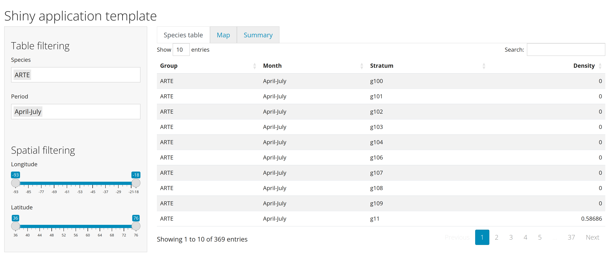

```{r include = FALSE}
source("_setup.R")
```

class: inverse, center, middle

# `r nf()` Minimal Shiny App


---
# Minimal Shiny App

`r lc()` [Simple shiny app](https://shiny.rstudio.com/gallery/single-file-shiny-app.html)

.pull-left[
```{r, eval = FALSE}
# Global variables can go here
n <- 200

# Define the UI
ui <- bootstrapPage(
  numericInput('n', 'Number of obs', n),
  plotOutput('plot')
)

# Define the server code
server <- function(input, output) {
  output$plot <- renderPlot({
    hist(runif(input$n))
  })
}

# Return a Shiny app object
shinyApp(ui = ui, server = server)

```
]

.pull-right[
  
  

]

???
So far we've looked at this simple app from a standpoint of reactive programming. 
Now we will look at it from the perspective of building a shiny app

---
# Minimal Shiny App

## Structure

- *Optional*: General environment

--

- `r ey()` User interface object `ui`:

  - Controls layout and appearance of the app (where to position the element to display)
  - Front end of the app
  - What the user sees and interacts with

--

- `r cg()` Server function `server`:

  - Instructions sent to the computer/server running R to build the app
  - Back end of the application

--

- A call to the shinyApp function `shinyApp(ui, server)`

---
# Minimal Shiy App: General environment 

```{r, eval = FALSE}
# Global variables can go here
n <- 200
```

- Located before the `ui` object and `server` function 
- Can be used to load any component that can be used by your app and needs to be loaded once only
  - Libraries
  - Data
  - Functions 
- These components should not affect your app efficiency once the app is loaded.


---
# Minimal Shiny App: `ui` `r ey()`

```{r, eval = FALSE}
ui <- bootstrapPage(
  numericInput('n', 'Number of obs', n),
  plotOutput('plot')
)
```

--

1. `ui` is the output of a function that creates a Shiny UI page (HTML), which defines the layout and its content.

--

2. layout: `bootstrapPage()` (see [Application layout guide](https://shiny.rstudio.com/articles/layout-guide.html))

--

3. input: `numericInput()` (see [Control widget](https://shiny.rstudio.com/gallery/widget-gallery.html))

--

4. output: `plotOutput()` (see [Display reactive output](https://shiny.rstudio.com/tutorial/written-tutorial/lesson4/))

--

5. add HTML content with tags (see [Shiny HTML Tags Glossary](https://shiny.rstudio.com/articles/tag-glossary.html))

---
# Minimal Shiny App: `server` `r cg()`

```{r, eval = FALSE}
server <- function(input, output) {
  output$plot <- renderPlot({
    hist(runif(input$n))
  })
}
```

--

1. server is a function of `input` and `output` and optionally `session` (used latter, but not covered, see [Session object](https://shiny.rstudio.com/reference/shiny/1.6.0/session.html))

2. process output: `renderPlot()` (see [Display reactive output](https://shiny.rstudio.com/tutorial/written-tutorial/lesson4/))

`r tr()` all `render*()` functions render reactive **output**, they 
capture R expressions and perform some light pre-processing to make the object suitable for the corresponding `*Output()` function in `ui`.


---
# Minimal Shiny App: `server` `r cg()`

## [Reactive output](https://shiny.rstudio.com/tutorial/written-tutorial/lesson4/)

.font90[
| Output function (`ui`) | Render function (`server`) | Creates     |
| :--------------------- | :------------------------- | :-----------|
| `dataTableOutput`      | `renderDataTable()`        | DataTable   |
| `htmlOutput`           | `renderImage()`            | raw HTML    |
| `imageOutput`          | `renderImage()`            | image       |
| `plotOutput`           | `renderPlot()`             | plot        |
| `tableOutput`          | `renderTable()`            | table       |
| `textOutput`           | `renderText()`             | text        |
| `uiOutput`             | `renderUI()`               | raw HTML    |
| `verbatimTextOutput`   | `renderVerbatimText()`     | text        |
]

---
# Minimal Shiny App: inputs & outputs 

### `r nf()` Be aware of ***ids***

```{r eval = FALSE}
numericInput('n', 'Number of obs', n)
```

---
# Minimal Shiny App: inputs & outputs 

### `r nf()` Be aware of ***ids***

```{r eval = FALSE}
numericInput(inputId = 'n', label = 'Number of obs', value = n)
```

--

### Typical inputs

```{r eval = FALSE}
whateverInput(inputId = "id", value = "val", ...)
```

--

- Creates a list object called `input` with `inputId` as vectors containing the elements chosen by the user that can be used by the server to update displayed elements. 

```{r, eval = FALSE}
input <- list(id = 'val')
input$id
> "val"
```

---
# Minimal Shiny App: inputs & outputs 

### `r nf()` Be aware of ***ids***

```{r eval = FALSE}
plotOutput('plot')
```

---
# Minimal Shiny App: inputs & outputs 

### `r nf()` Be aware of ***ids***

```{r eval = FALSE}
plotOutput(outputId = 'plot')
```

--

### Typical outputs

.pull-left[
`ui` `r ey()`

```{r eval = FALSE}
whateverOutput(inputId = "id", ...)
```
]

.pull-right[
`server` `r cg()`

```{r, eval = FALSE}
output$id <- renderWhatever(...)
```
]


---
# Minimal Shiny App: run the app

```{r, eval = FALSE}
shinyApp(ui = ui, server = server)
```

`r lc()` Trigger the application. 

--

There are several ways to do so, see [App formats and launching apps](https://shiny.rstudio.com/articles/app-formats.html).


---
# Minimal Shiny App: create a project

.pull-left[
***From scratch***:

- Create a project folder 
- Add code in a script called `app.R`
- Fire up R and load Shiny package 
- Run the app! 

```{r, eval = FALSE} 
shiny::runApp("app.R")
```
]

---
# Minimal Shiny App: create a project

.pull-left[
***From scratch***:

- Create a project folder 
- Add code in a script called `app.R`
- Fire up R and load Shiny package 
- Run the app! 

```{r, eval = FALSE} 
shiny::runApp("app.R")
```
]

.pull-right[
***Using `r rp()` Studio***:

- Open `r rp()` Studio 
- Either:
  - New file 
  - New project 
- Shiny Web Application 
- Launch application
  - `|> Run App`
  - `Cmd/Ctrl + Shift + Enter`
]

---
# Minimal Shiny App: app view  

***Options to view your application:***

1. Pop-out window (default)
2. Viewer pane 
3. External (*i.e.* your web browser)

---
# Minimal Shiny App: workflow 


***Typical Shiny development workflow:***

1. Write code.
2. Launch the app
3. Play with the app
4. Close the app
Repeat

--

`r nf()` you can also trigger autoreload, see [here](https://github.com/sol-eng/background-jobs/tree/master/shiny-job)

`r tr()` but be aware that this makes debugging the app much harder


---
# Minimal Shiny App: create a project 

### `r lc()` Create Shiny project and launch the default Shiny app provided by `r rp()` Studio

`r cdw(minutes = 15, seconds = 0, margin = "1em")`

---
# Minimal Shiny App: reactive graph

### [`reactlog`](https://rstudio.github.io/reactlog/) draws the reactive graph for you! 

> Behind the scenes, Shiny builds a reactive graph that can quickly become intertwined and difficult to debug. reactlog provides a visual insight into that black box of Shiny reactivity.

--

***How to use `reactlog`***

--
- Run `reactlog::reactlog_enable()` before launching your app

--
- Type `Cmd + F3` (`r rfa("apple")`) or `Ctrl + F3` (`r rfa("windows")` `r rfa("linux")`) while app is running

--
- Alternatively, run `shiny::reactlogShow()` once you close the app


--

### `r lc()` Use `reactlog` with the default Shiny app

`r cdw(minutes = 10, seconds = 0, margin = "1em")`


---
# Minimal Shiny App: debugging 

***Troubleshooting in Shiny is not intuitive at first***

***Common problems:***

- Unexpected error (*easiest*)
- No error, yet incorrect value (*medium*)
- Values correct, but unexpected update (*hardest*)

---
# Minimal Shiny App: debugging 

### Error traceback

```{r, eval = FALSE}
f <- function(x) g(x)
g <- function(x) h(x)
h <- function(x) x * 2
f("a")
#> Error in x * 2: non-numeric argument to binary operator
```

--

```{r, eval = FALSE}
traceback()
#> 3: h(x)
#> 2: g(x)
#> 1: f("a")
```

.font90[`r nf()` example from [Mastering Shiny book](https://mastering-shiny.org/action-workflow.html#reading-tracebacks)]

---
# Minimal Shiny App: debugging 

### Error traceback in Shiny

- By default, Shiny provides a traceback in the console

```
Error in *: non-numeric argument to binary operator
  169: g [app.R#4]
  168: f [app.R#3]
  167: renderPlot [app.R#13]
  165: func
  125: drawPlot
  111: <reactive:plotObj>
   95: drawReactive
   82: renderFunc
   81: output$plot
    1: runApp
```

.font90[`r nf()` example from [Mastering Shiny book](https://mastering-shiny.org/action-workflow.html#reading-tracebacks)]

???
show live by change `input$bins + 1` to `input$bins + "a"` in server 

---
# Minimal Shiny App: debugging 

### Interactive debugger

.pull-left[
***`browser()`***

.font90[  
```{r, eval = FALSE}
server <- function(input, output, session) {
  selected <- reactive({
    browser()
    subset(sales, TERRITORY %in% input$territory)
  })
}
```
]

.font90[`r tr()` Do not forget to remove once finished debugging]
]

.pull-right[
***`r rp()` Studio breakpoint***


.font90[`r tr()` Can only be run in the server function]
]

---
# Minimal Shiny App: debugging 

### Tracing

***Showcase Mode***

`shiny::runApp(display.mode="showcase")`


---
# Minimal Shiny App: debugging 

### Tracing

***"Print" debugging***: print messages in the console while app is running

```{r, eval = FALSE}
# generate bins based on input$bins from ui.R
x    <- faithful[, 2]
bins <- seq(min(x), max(x), length.out = input$bins + 1)
message(glue::glue("updating histogram with {length(bins)} bins"))
```

---

class: inverse, center, middle

# `r nf()` Exercise 1


---
# Minimal Shiny App: And so it begins...

***Context***

> Some partner are in charge of determining key biodiversity area of sea birds in eastern canada
and we would like us to help them by providing a tool that gather data and explore those areas. 


---
# Minimal Shiny App: And so it begins...


***Objective***:

> Build a Shiny app that will allow you to filter a data table and visualize the filtered table

--

***Data*** `r db()`

- Atlas of Seabirds at Sea in Eastern Canada 2006-2016 [`r db()`](https://open.canada.ca/data/en/dataset/f612e2b4-5c67-46dc-9a84-1154c649ab4e)

.pull-left[
```{r, eval = FALSE}
library(shiny)
source("setup.R")
densities <- read.csv("data/densities.csv")
```
]

.pull-right[
```{r, eval = FALSE}
densities <- read.csv("data/densities.csv")
head(densities)
```
]

---
# Minimal Shiny App: building the app

***Data*** `r db()`
- bird density

--

***layout*** (ui) `r ey()`
- side panel: user inputs
- main panel: server outputs

--

***user inputs*** (ui) `r ey()`
- select input: `species`
- select input: `periods`

--

***server output*** `r cg()`
- filter data based selected inputs
- render filtered table

---
# Minimal Shiny App: building the app

.pull-left[
***Data*** `r db()`
- bird density
]

.pull-right[
***What to do***

- Download and format the data [`r fl()`](https://github.com/inSilecoInc/cws-shiny-template/blob/main/setup.R)
- Import species density table as global variable 
]

`r cdw(minutes = 10, seconds = 0, margin = "1em")`

---
# Minimal Shiny App: building the app

.pull-left[
***Data*** `r db()`
- bird density `r ch()`

***layout*** (ui) `r ey()`
- side panel: user inputs
- main panel: server outputs
]

.pull-right[
***What to do***

```{r, eval = FALSE}
?fluidpage
?sidebarLayout
?sidebarPanel
?mainPanel
```

.font80[`r nf()` Go [here](https://shiny.rstudio.com/articles/layout-guide.html) for an example of such a layout]
]

`r cdw(minutes = 10, seconds = 0, margin = "1em")`

---
# Minimal Shiny App: building the app

.pull-left[
***Data*** `r db()`
- bird density `r ch()`

***layout*** (ui) `r ey()`
- side panel: user inputs `r ch()`
- main panel: server outputs `r ch()`

***user inputs*** (ui) `r ey()`
- select input: species
- select input: periods

***server output*** `r cg()`
- filter data based selected inputs
- render filtered table
]

.pull-right[
***What to do***

- Draw the reactive graph for the user inputs and server outputs
]

`r cdw(minutes = 5, seconds = 0, margin = "1em")`


---
# Minimal Shiny App: building the app

.pull-left[
***Data*** `r db()`
- bird density `r ch()`

***layout*** (ui) `r ey()`
- side panel: user inputs `r ch()`
- main panel: server outputs `r ch()`

***user inputs*** (ui) `r ey()`
- select input: species
- select input: periods

***server output*** `r cg()`
- filter data based selected inputs
- render filtered table
]

.pull-right[
***What to do***

- In side panel: 
  - Add user input for species
  - Add user input for periods


.font80[`r nf()` [here](https://shiny.rstudio.com/gallery/widget-gallery.html) for control widgets]
]

`r cdw(minutes = 10, seconds = 0, margin = "1em")`


---
# Minimal Shiny App: building the app

.pull-left[
***Data*** `r db()`
- bird density `r ch()`

***layout*** (ui) `r ey()`
- side panel: user inputs `r ch()`
- main panel: server outputs `r ch()`

***user inputs*** (ui) `r ey()`
- select input: species `r ch()`
- select input: periods `r ch()`

***server output*** `r cg()`
- filter data based selected inputs
- render filtered table
]

.pull-right[
***What to do***

- Create reactive expression to filter table based on user inputs
- Add table output in main panel


.font80[`r nf()` [here](https://shiny.rstudio.com/tutorial/written-tutorial/lesson6/) for more information on reactive expressions]

.font80[`r nf()` [here](https://shiny.rstudio.com/tutorial/written-tutorial/lesson4/) for more on displaying reactive outputs]
]

`r cdw(minutes = 20, seconds = 0, margin = "1em")`

---
# Solution 



https://github.com/inSilecoInc/cws-shiny-template/blob/practice1/practice1/app.R


---

# Pipes `|>` | `%>%`

The pipe operators `|>` (`|` + `>`) (native R) or %>% (using `magrittr`) are a chained method that lets you pass an intermediate result to the next function.

--

.pull-left[
```{r use_pipe, eval = FALSE}
# Example with pipe operator
dat <- dplyr::filter(
  densities, 
  Group %in% input$species
) |>
dplyr::select(Group)
```
]

.pull-right[
```{r nopipe, eval = FALSE}
# Example without pipe operator
dat <- dplyr::filter(
  densities, 
  Group %in% input$species
)

dat <- dplyr::select(dat, Group)
```
]


.font70[`%>%` is similar to the `+` operator used by `ggplot2`]

.font70[See [here](https://www.datacamp.com/community/tutorials/pipe-r-tutorial) for a full description of the history and use of pipes. 
]