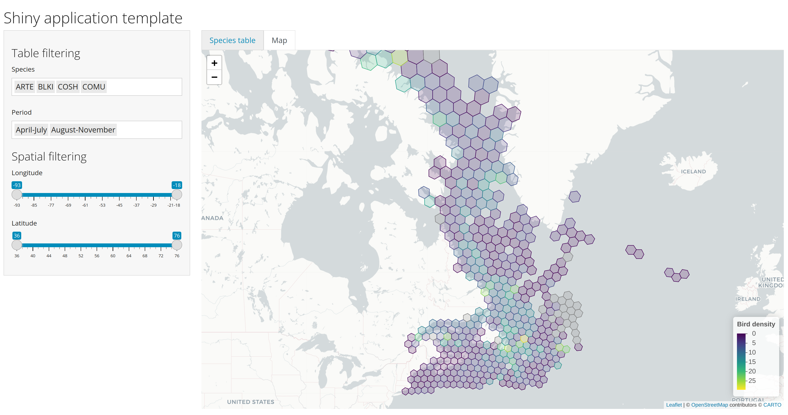

```{r include = FALSE}
source("_setup.R")
```


class: inverse, center, middle

# `r nf()` Practice 2


## `r ck()` ~1h20min

---
# Interactive spatial shiny app 

After some discussion, the partner would like us to add some new spatial feature.
We will add a new tab with the bird density polygons and two new sliders to specify a bbox area (latitude and longitude range).

.pull-left[
***Data*** `r db()`
- Density polygons (`AtlasGrid-GrilleAtlas.gdb`, layer: `AtlasGrid_GrilleAtlas`)
]

.pull-right[
***What to do***

- If not already done, download the data [`r fl()`](https://github.com/inSilecoInc/cws-shiny-template/blob/main/setup.R)
- Import the layer `AtlasGrid_GrilleAtlas` from the `AtlasGrid-GrilleAtlas.gdb` geodatabase as a global variable
- Load the layer as a spatial `sf` object (`sf::st_read`), transform the original projection to WGS84 standard
]

`r cdw(minutes = 10, seconds = 0, margin = "1em")`


---
# Interactive spatial shiny app

.pull-left[
***Data*** `r db()`
- Density polygons (`AtlasGrid-GrilleAtlas.gdb`, layer: `AtlasGrid_GrilleAtlas`)

***new user inputs*** (ui) `r ey()`
- `sliderInput`: latitude
- `sliderInput`: longitude

***new server output*** `r cg()`
- filter spatial data based on the new sliders
- render a leaflet map: filled with the density sum (selected species)
]

.pull-right[
***What to do***
- First, try to first make the map reactive to the latitude and longitude sliders
- Then, set the polygons color fill based on the density sum of the selected species
- Draw the new reactive graph for the user inputs and server outputs
]

`r cdw(minutes = 30, seconds = 0, margin = "1em")`


---
# Interactive spatial shiny app

.pull-left[
***Data*** `r db()`
- Density polygons (`AtlasGrid-GrilleAtlas.gdb`, layer: `AtlasGrid_GrilleAtlas`)

***new user inputs*** (ui) `r ey()`
- `sliderInput`: latitude
- `sliderInput`: longitude

***new server output*** `r cg()`
- filter spatial data based on the selected latitude and longitude range
- render a leaflet map filled with the density sum of the selected species
]

.pull-right[
***What to do***
- Draw the reactive graph for the user inputs and server outputs 
to have better overview of the new reactive elements
]

`r cdw(minutes = 5, seconds = 0, margin = "1em")`

---
# Solution 



https://github.com/inSilecoInc/cws-shiny-apps/blob/main/practice2/app.R

---
# Examples

## Sky's the limit

<br>

--

## Two Examples:


### 1. [*eDrivers*](https://david-beauchesne.shinyapps.io/edriversapp/) `shiny` app

--

### 2. [*Spatial Reproducible Reporting*](https://github.com/inSilecoInc/shinySpatialApp) `shiny` app