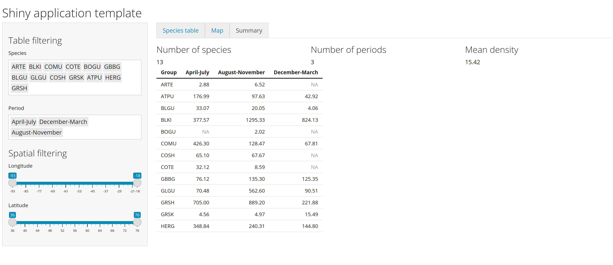

```{r include = FALSE}
source("_setup.R")
```


class: inverse, center, middle

# `r nf()` Our Shiny V3


## `r ck()` ~2h


---
# Reactivity, escaping the graph

TODO

---

# Data synthesis within the shiny app

The partner would like us to add an additional summary with the following statistics:

- Number of species selected
- Number of period selected
- Mean density for the periods and species selected
- A table summarizing the mean density by period (column) and species (row)

---

# Data synthesis within the shiny app

.pull-left[
***Data*** `r db()`
- We already have all the raw data that we need. 
]

.pull-right[
***What to do***
- Think of which variables will be reactive and involved in each computation
- Declared the new tab in the UI
- Prepared and computed the output variable 
]

`r cdw(minutes = 20, seconds = 0, margin = "1em")`


---
# Solution 



https://github.com/inSilecoInc/cws-shiny-apps/blob/main/practice3/app.R